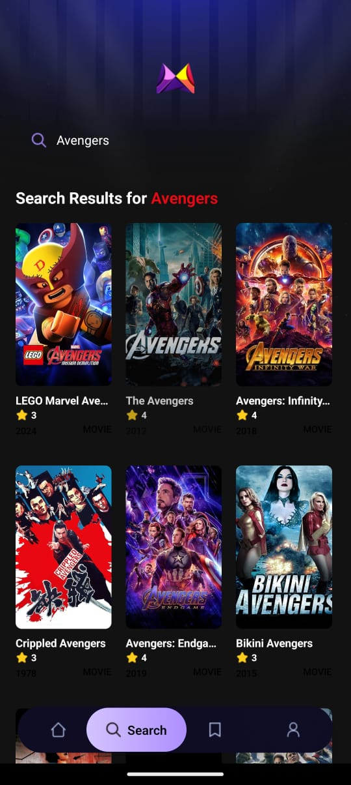
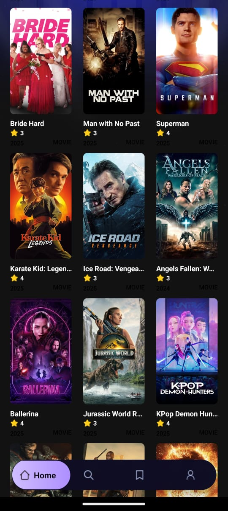
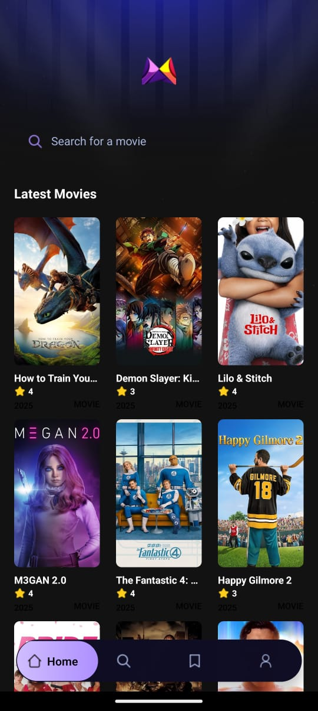
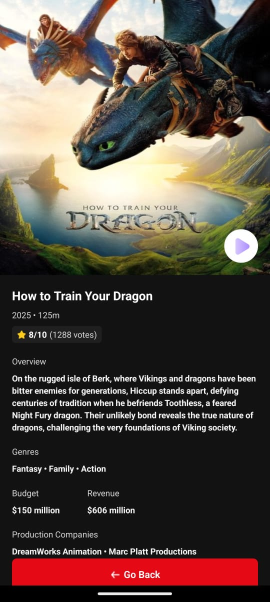

# 🎬 React Native Movie App

A beautiful and modern mobile app to browse popular movies, view details, and stream trailers — built using **React Native**, **Expo**, **NativeWind**, and **TMDB API**.


---

## ✨ Features

- 🔍 Browse popular movies from [TMDB](https://www.themoviedb.org/)
- 🎥 View movie trailers and posters
- 📄 Get detailed info like genres, rating, budget, and more
- 🎨 Dark-themed UI using Tailwind (via NativeWind)
- 🔁 Scrollable and responsive layouts

---

## 📸 Screenshots

### 🏠 Home Screen


### 🏠 Alternate Home Screen


### 🔍 Search Screen


### 🎬 Select Screen


### 🧾 Explore Details Screen



## 🚀 Getting Started

### 📦 Prerequisites

- Node.js ≥ 16.x
- Expo CLI (`npm install -g expo-cli`)
- TMDB API Key (Get from [here](https://www.themoviedb.org/documentation/api))

---

### 🛠 Installation

```bash
git clone https://github.com/yourusername/react-native-movie-app.git
cd react-native-movie-app
npm install

🧪 Running the App
bash
Copy
Edit
npm start
Then scan the QR code using the Expo Go app on your phone.

⚙️ Project Structure
bash
Copy
Edit
├── app/                  # Main screens (e.g. Details.tsx)
├── components/           # Reusable UI components
├── constants/            # Static assets and icons
├── services/             # API calls and data fetching
├── tailwind.config.js    # Tailwind setup for NativeWind
├── assets/               # Images and screenshot assets
└── App.tsx               # Entry point

🔧 Configuration
Update your .env or API config in /services/api.ts with your TMDB key:
ts
Copy
Edit
📦 Tech Stack
⚛️ React Native + Expo
🎨 Tailwind CSS via NativeWind
🔌 TMDB API
🪝 React Hooks & Expo Router

🙌 Acknowledgements
TMDB API
NativeWind
React Native
Expo

📄 License
This project is licensed under the MIT License - see the LICENSE file for details.
